# 🎯 Quiz App

This is a **cross-platform Quiz App** built using **React Native** with **Expo** and styled using **Tamagui**. The app works seamlessly on **iOS, Android, and Web**. Users can take quizzes, receive instant feedback, and view results at the end.

### Open this link on your Android devices (or scan the QR code) to install the app:

```
https://expo.dev/accounts/simplify_money/projects/simplifymoney/builds/207606a2-8fcd-4d4f-af0f-2514b1c8c459
```


```bash

## ✨ Features

- ✅ Randomly selects 5 questions from a question bank.
- ✅ Supports multiple platforms:
  - 📱 iOS
  - 🤖 Android
  - 🌐 Web
- ✅ Interactive UI with option selection, real-time feedback, and results.
- ✅ Built-in back button prevention during the quiz.
- ✅ Expo Go support for quick testing and preview.

---

## 📦 Tech Stack

- **React Native** - For building cross-platform mobile applications.
- **Expo** - For simplifying the build process and enabling Expo Go functionality.
- **Tamagui** - For responsive and beautiful UI across platforms.
- **TypeScript** - Ensures type safety and better code maintainability.

---


git clone https://github.com/navinrmeena/quiz-app.git
cd quiz-app
```

## 🚀 Getting Started

### 1. Clone the repository

```bash
git clone https://github.com/navinrmeena/quiz-app.git
cd quiz-app
```

## 2. Install dependencies

```bash
yarn install
```

## 3. Start the app

```bash
yarn start
```

## 🎮 Testing on Expo Go

Download Expo Go from the App Store or Google Play.
Run yarn start and scan the QR code with Expo Go.
Enjoy your quiz on mobile!

# 📸 App Screenshots

Here are the screenshots of the app:

---

## 🖼️ Screenshots

### ios

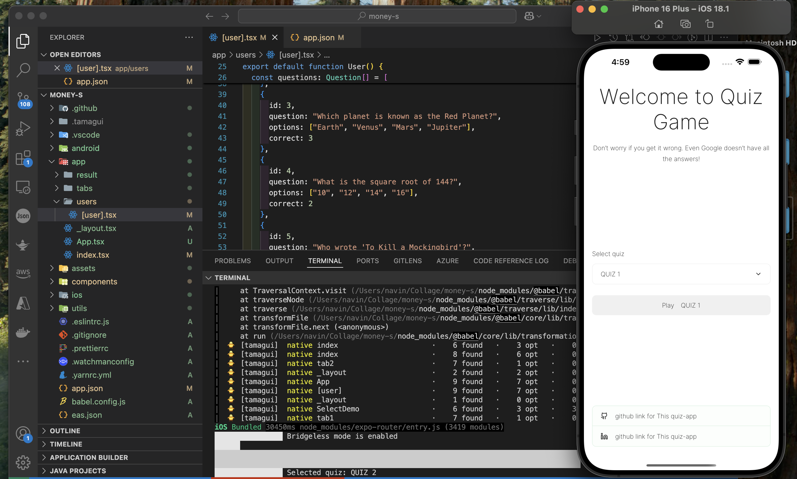
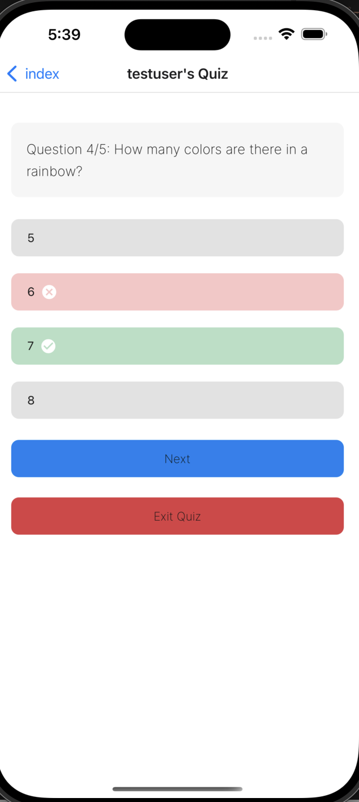
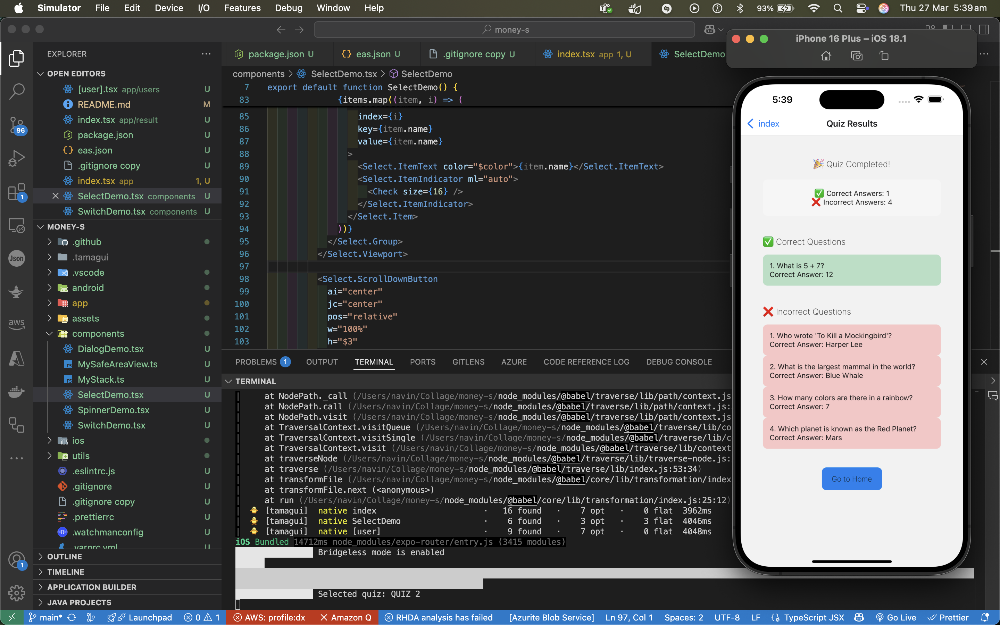
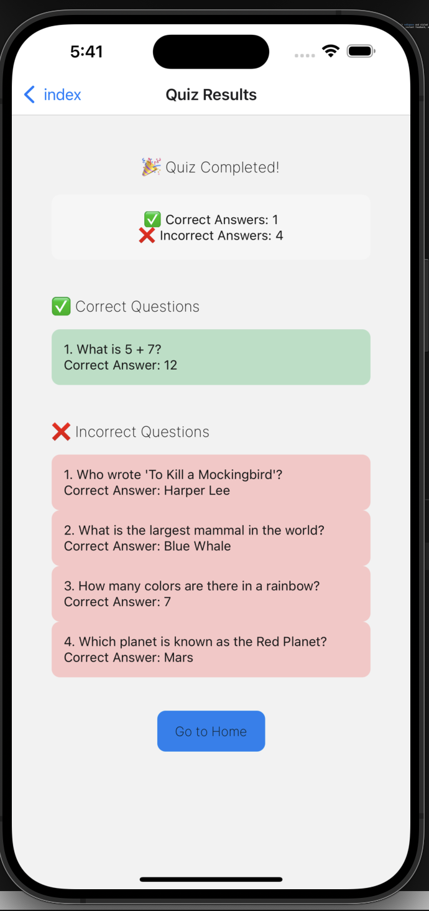

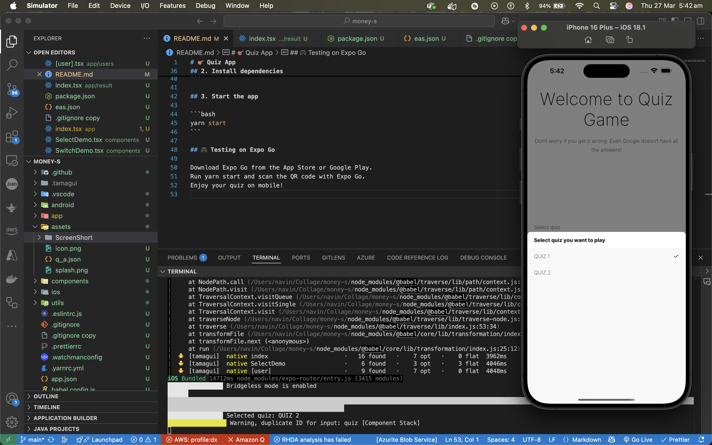
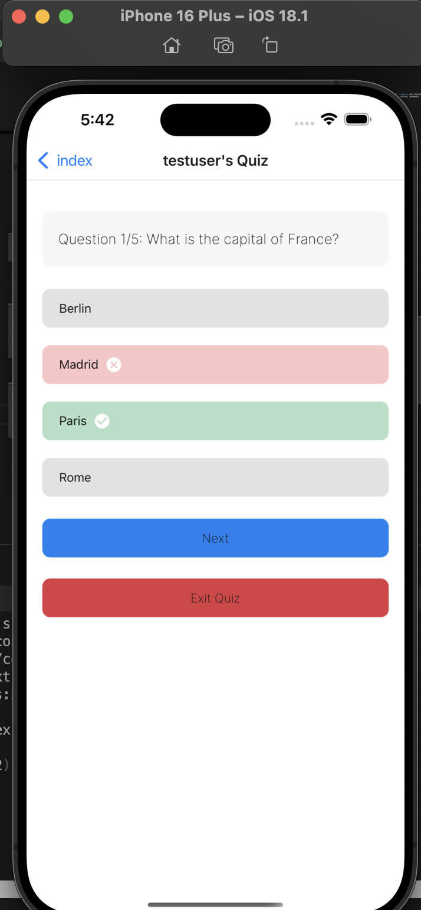
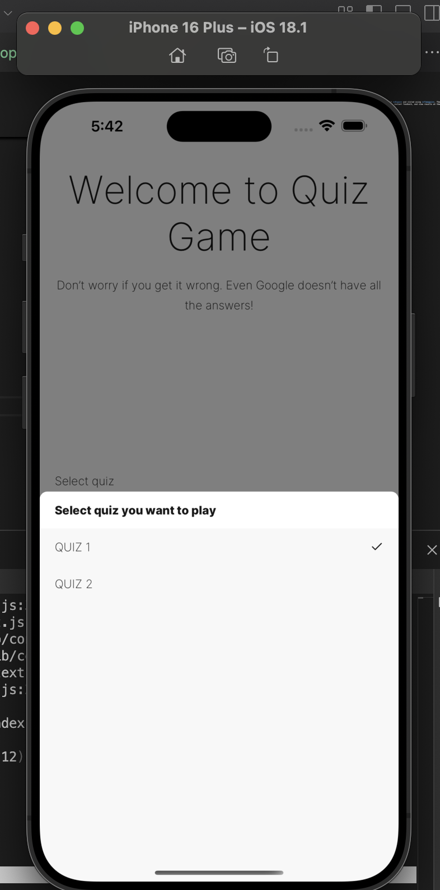
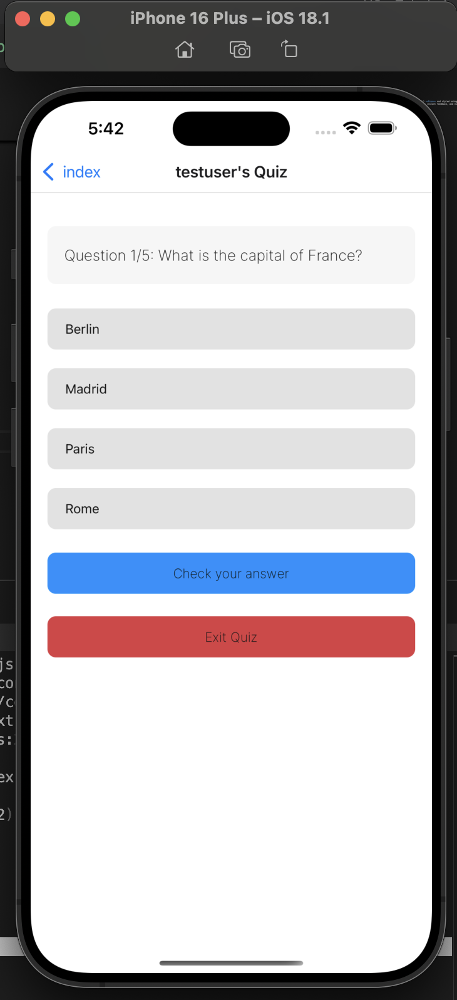
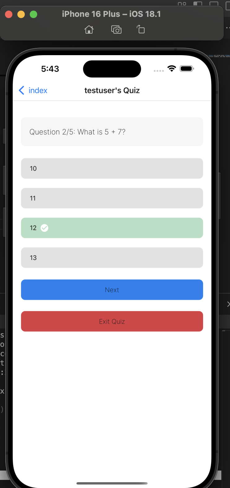

### Andriod and DarkMode

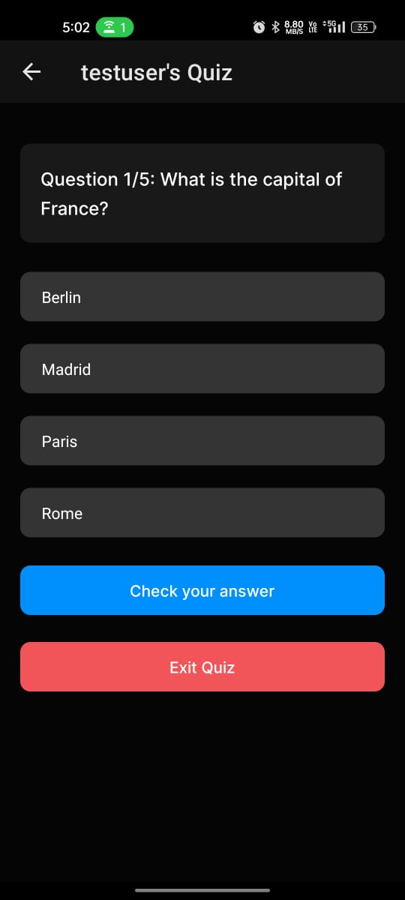
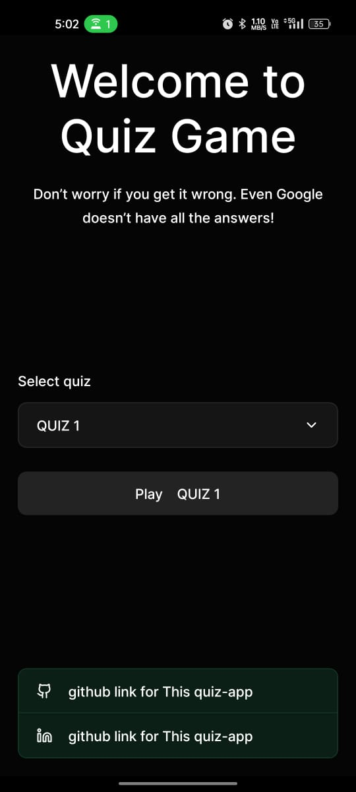
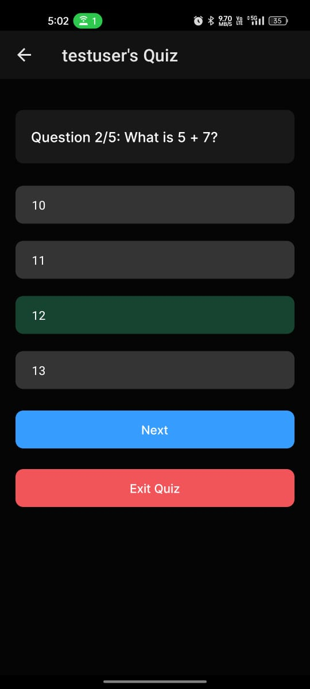

z

### Web

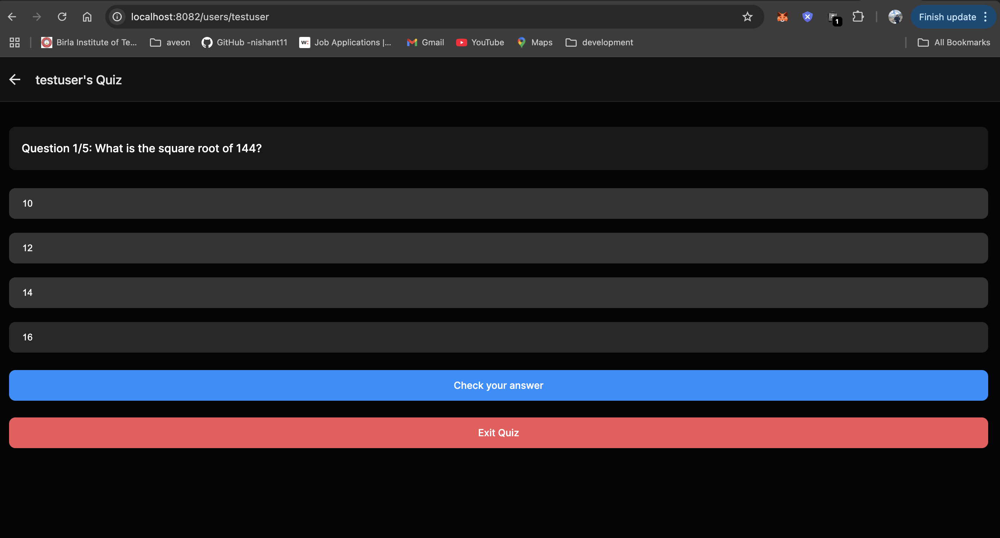
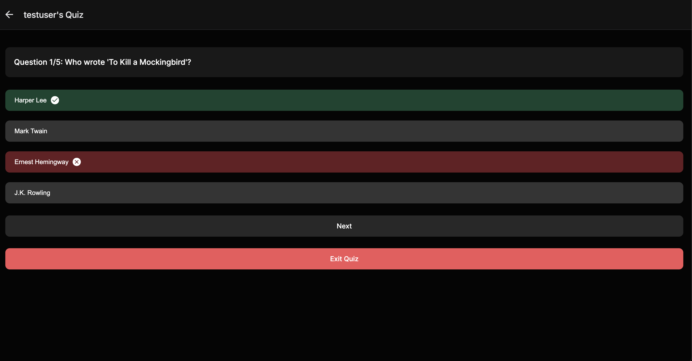
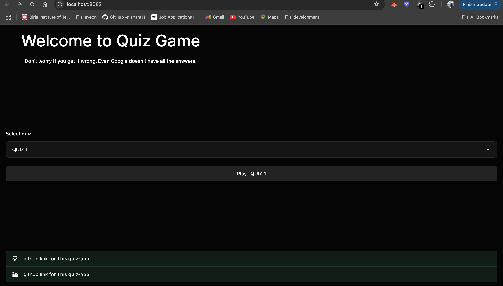
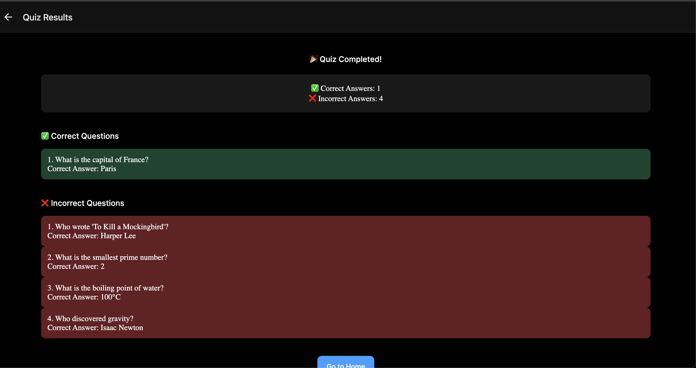

---

## 🎨 App Icon


